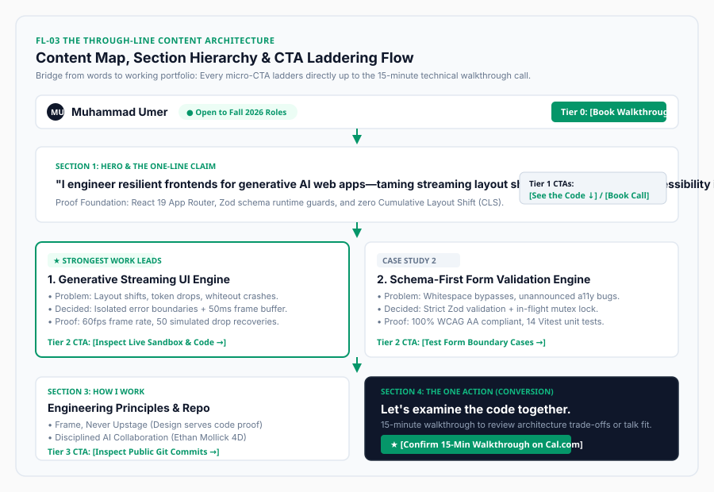

# Task 10: The Through-Line: Map Content & CTAs

[](#)
[](#)
[](#)
[](#)
[](#)
[](#)

> **Assignment Reference**: [The Through-Line: Map Content & CTAs (FlyRank Week 3)](https://aifluency.flyrank.ai/week-03.html#the-through-line)  
> **Author**: Muhammad Umer  
> **Target Audience**: Frontend Engineering Manager / Technical Lead at an AI Startup  
> **The One Action**: Book a 15-minute live technical walkthrough call  
> **Core Mandate**: *"A good case in the wrong place still fails. Before you build, know exactly what goes on which page, the one-line claim that greets a visitor, and where every page sends them. This map is the bridge from words to a working portfolio."*

---

## 📌 Executive Summary

> *"Before you build, know exactly what goes on which page, the one-line claim that greets a visitor, and where every page sends them. This map is the bridge from words to a working portfolio."*

This repository directory contains the standalone deliverables for the FlyRank Week 3 assignment: **"The Through-Line: Map Content & CTAs"**.

It builds the structural architecture that turns written case studies into a high-converting web portfolio:
1. **The One-Line Claim**: Generated 10 distinct AI candidates across 4 strategic angles, evaluated trade-offs, and sharpened into a punchy 19-word claim stating exactly what is proven.
2. **Multi-Page / Section Content Map**: A complete 5-stage ordered flow where the strongest work leads (*Generative Streaming UI & Resilient Error Boundaries*).
3. **The CTA Ladder**: Every button and micro-interaction ladders directly up to the **One Action** (booking a 15-minute live technical walkthrough call).
4. **Honest "Still Need to Gather" Checklist**: An 8-point inventory distinguishing ready code assets from proof items to capture during Week 4 stack setup, ensuring zero build blockers.

---

## 📂 Deliverables Directory Structure

```
ai fluency tasks/task 10/
├── README.md                              # Master showcase, executive summary & compliance matrix
├── THROUGH_LINE_CONTENT_MAP.md            # Master content architecture (Claim, Map, CTA ladder, Gather-list)
├── SUBMISSION_TEMPLATE.md                 # Ready-to-copy portal submission fields (Links, Notes, Uploads)
└── content-map-architecture.svg           # Visual architecture flow diagram of sections & CTA ladder
```

---

## 🎯 1. The Sharpened One-Line Claim

> **"I engineer resilient frontends for generative AI web apps—taming streaming layout shifts, token errors, and accessibility in React 19 and TypeScript."**

* **Origin**: 10 candidates generated with Claude 3.5 Sonnet across Outcome, Stack, Contrarian, and Direct Value angles.
* **Why It Sticks**: It replaces vague corporate adjectives (*"passionate," "cutting-edge"*) with the three hardest physical bugs in generative web apps: **Cumulative Layout Shift**, **token stream crashes**, and **keyboard accessibility**.

---

## 🗺️ 2. The Content Map & CTA Hierarchy



| Section Order | Section ID | Core Content Elements | Named CTA | Destination / Conversion Ladder Role |
| :-: | :--- | :--- | :--- | :--- |
| **Tier 0** | `Global Nav` | Monogram logo + Availability pill | `[Book Walkthrough]` | Fast-track shortcut directly to `#contact` booking slot. |
| **Tier 1** | `Hero` | One-line claim + Token streaming mini-demo | `[See the Code ↓]` | Pulls reviewer down to deep-dive evidence. |
| **Tier 1** | `Hero` | Proof subhead + Stack tokens | `[Book 15-Min Call]` | Smooth scroll down to scheduler. |
| **Tier 2** | `Case 1` *(Star)* | **Generative Streaming UI & Error Boundaries** | `[Inspect Live Sandbox & Code →]` | Physical validation: reviewer breaks live stream in browser. |
| **Tier 2** | `Case 2` | **Schema-First Form Validation Engine** | `[Test Form Boundary Cases →]` | Rigor validation: checks WCAG 2.1 AA and Zod edge cases. |
| **Tier 3** | `Standards` | 3 Engineering Principles & Git log | `[Inspect Public Git Commits →]` | Professional hygiene: verifies Conventional Commits. |
| **Tier 4** | `Contact` | Cal.com 15-min scheduler + 1-click email | **`[Confirm 15-Min Walkthrough]`** | **THE ONE ACTION**: Confirms calendar booking. |

---

## 📋 3. Honest "Still Need to Gather" Checklist

| # | Evidence Item | Current Status | Action Required Before Build Week | Owner / Target |
| :-: | :--- | :---: | :--- | :---: |
| **1** | Streaming UI Live Sandbox | 🟡 In Local Workspace | Deploy standalone Next.js 15 / React 19 route to Netlify with mock SSE server. | Muhammad Umer (Week 4) |
| **2** | Streaming CLS Screen Recording | 🔴 Needs Capture | Record 8-second WebP capture showing Chrome DevTools Layout Shift bounds. | Muhammad Umer (Week 4) |
| **3** | Form Validation Sandbox | 🟡 In Local Workspace | Extract Zod schema form component into public demo route (`/sandbox/form`). | Muhammad Umer (Week 4) |
| **4** | Screen Reader Audio / Tree Capture | 🔴 Needs Capture | Capture VoiceOver DevTools tree announcing dynamic `role="alert"` errors. | Muhammad Umer (Week 4) |
| **5** | Vitest Test Suite Output | 🟢 Ready | Terminal capture of 14 passing unit tests covering trim & regex edge cases. | Ready in Workspace |
| **6** | Public GitHub Repositories | 🟢 Ready | Clean `flyrank-tasks` repository with Conventional Commits history. | Complete |
| **7** | Cal.com 15-Min Booking Link | 🟢 Ready | Active Cal.com event type: *"15-Min Technical Walkthrough with Muhammad Umer"*. | Complete |
| **8** | Personal Natural-Light Portrait | 🟢 Ready | High-resolution photography of Muhammad Umer at desk (no AI avatars). | Complete |

---

## ✅ Evaluation Criteria Compliance Matrix

| Criteria (Pass / Revise) | Requirement | Implementation Detail | Status |
| :--- | :--- | :--- | :---: |
| **A single, memorable claim, not a paragraph** | 1 concise sentence stating what you prove. | Sharpened 19-word claim: *"I engineer resilient frontends for generative AI web apps—taming streaming layout shifts, token errors, and accessibility in React 19 and TypeScript."* | 🟢 **PASS** |
| **Ordered sections & named CTAs** | Ordered sections; strongest work leads; explicit CTA naming. | Complete 5-tier ordered section flow; Case 1 (Streaming UI) leads; named CTAs at every step. | 🟢 **PASS** |
| **CTAs ladder up to the One Action** | Every micro-action supports the One Action. | 5-tier CTA ladder routing micro-proof into the 15-minute walkthrough calendar booking. | 🟢 **PASS** |
| **Honest gather-list prevents blockage** | Clear audit of finished vs. unfinished proof assets. | 8-point checklist explicitly identifying items ready vs. items to capture during Week 4. | 🟢 **PASS** |

---

## 🚀 Portal Submission Guide

See [SUBMISSION_TEMPLATE.md](SUBMISSION_TEMPLATE.md) for the exact URLs, concise reviewer notes, and file attachments formatted for immediate submission into the FlyRank portal modal.
