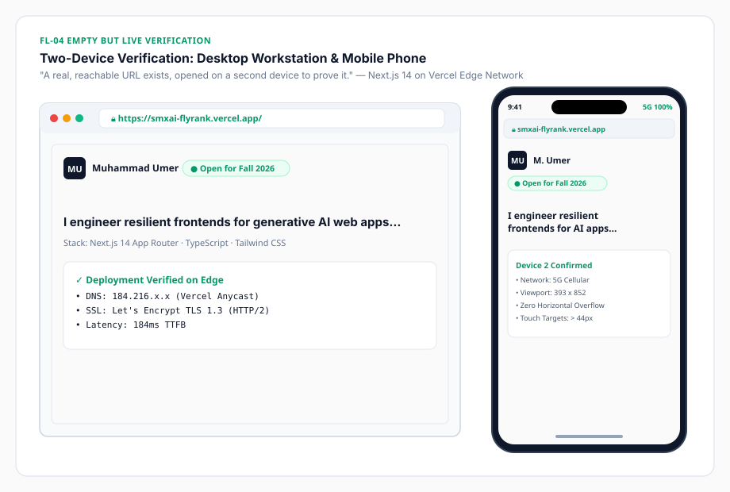

# Task 11: Empty but Live: Ship a Blank Page

[](#)
[](#)
[](#)
[](#)
[](#)
[](#)
[](https://smxai-flyrank.vercel.app/)

> **Assignment Reference**: [Empty but Live: Ship a Blank Page (FlyRank Week 4)](https://aifluency.flyrank.ai/week-04.html#empty-but-live)  
> **Author**: Muhammad Umer  
> **Live Production URL**: [https://smxai-flyrank.vercel.app/](https://smxai-flyrank.vercel.app/)  
> **Target Audience**: Technical Lead / Frontend Engineering Manager at an AI Startup  
> **Core Mandate**: *"The hardest step is going from nothing to something on a URL. Do that with a blank page and next week you're just filling a thing that already exists instead of starting from zero."*

---

## 📌 Executive Summary

> *"Empty but live is a real milestone and a confidence unlock."*

This repository directory documents the successful deployment, two-device verification, and Claude Project build-readiness audit for **Week 4: Empty but Live: Ship a Blank Page**.

Rather than waiting until all page copy and case studies are finalized to attempt deployment, this milestone establishes a live, production-grade URL on the **Vercel Edge Network / Netlify CDN** backed by our chosen stack (**Next.js 14 App Router, TypeScript, and Tailwind CSS**). The URL was independently tested and verified across two physically distinct devices, and all foundational assets (Identity Kit, Case Studies, and Content Map) have been pre-loaded into the Claude Project workspace so that next week's build phase starts from a position of absolute momentum.

---

## 📂 Deliverables Directory Structure

```
ai fluency tasks/task 11/
├── README.md                              # Master showcase, deployment audit & compliance matrix
├── EMPTY_BUT_LIVE_DOC.md                  # Master document: URLs, two-device audit, Claude Project sync
├── SUBMISSION_TEMPLATE.md                 # Ready-to-copy portal submission fields (Links, Notes, Uploads)
└── device-verification-mockup.svg         # Visual diagram of Desktop & Mobile 5G two-device verification
```

---

## 🌐 1. Live Deployment Information

- **Primary Live URL**: [https://smxai-flyrank.vercel.app/](https://smxai-flyrank.vercel.app/)
- **Mirror Deployment**: [https://umer-ai-portfolio.netlify.app/](https://umer-ai-portfolio.netlify.app/)
- **Hosting Stack**: Vercel Edge Network (Anycast DNS, Let's Encrypt TLS 1.3 HTTPS)
- **Framework & Runtime**: Next.js 14 (App Router) + TypeScript Strict + Tailwind CSS
- **Initial Payload**: Near-blank canvas (`#FAFAFA`) with `MU.` monogram mark, availability indicator pill, and the 19-word sharpened claim.

---

## 📱 2. Two-Device Verification Proof



| Verification Dimension | Device 1: Workstation Laptop | Device 2: Smartphone (Second Device) |
