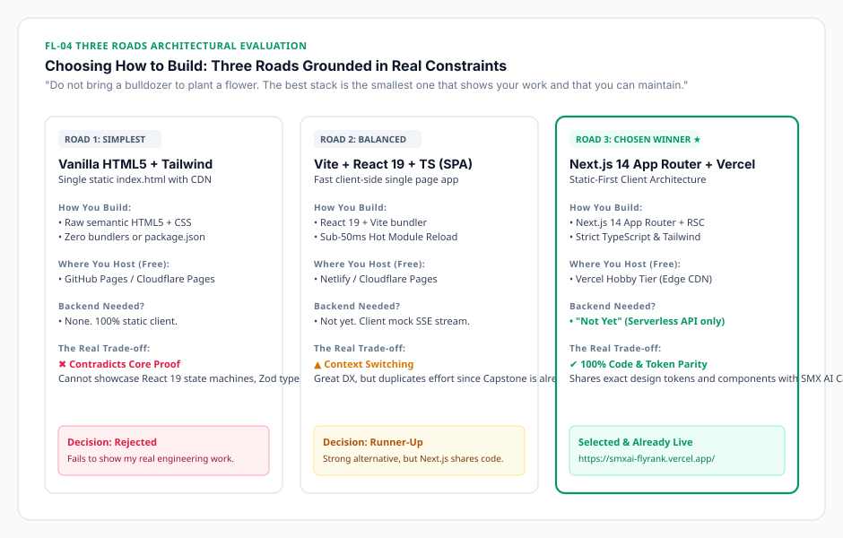

# Task 12: Three Roads: Choose Your Stack with AI

[](#)
[](#)
[](#)
[](#)
[](#)
[](#)
[](https://smxai-flyrank.vercel.app/)

> **Assignment Reference**: [Three Roads: Choose Your Stack with AI (FlyRank Week 4)](https://aifluency.flyrank.ai/week-04.html#three-roads)  
> **Author**: Muhammad Umer  
> **Target Audience**: Technical Lead / Frontend Engineering Manager at an AI Startup  
> **Core Mandate**: *"The win isn't getting AI to pick for you; it's giving it your real constraints, including how your work must be shown, making it lay out options and trade-offs, and deciding for yourself with eyes open. That habit outlasts this one site."*

---

## 📌 Executive Summary

> *"Do not bring a bulldozer to plant a flower. The best stack is the smallest one that does the job, displays your work properly, and that you can maintain."*

This repository directory documents the complete architectural evaluation and decision rationale for **Week 4: Three Roads: Choose Your Stack with AI**.

Rather than asking an AI assistant *"what should I use?"* and accepting a generic decree, this exercise grounded AI in four strict real-world constraints (**free only**, **honest skill level**, **5-stage content map**, and **interactive streaming proof requirements**). It forced AI to produce three genuine architectural paths from simplest to most powerful, pressure-tested the front-runner against a strict two-week delivery deadline, and articulated an authentic decision rationale written in my own engineering voice.

---

## 📂 Deliverables Directory Structure

```
ai fluency tasks/task 12/
├── README.md                              # Master showcase, comparative matrix & compliance checklist
├── THREE_ROADS_STACK_DECISION.md          # Master architecture document (Constraints, 3 roads, pressure-tests, rationale)
├── SUBMISSION_TEMPLATE.md                 # Ready-to-copy portal submission fields (Links, Notes, Uploads)
└── stack-tradeoffs-matrix.svg             # Visual architectural comparison matrix of the three roads
```

---

## 🛣️ 1. The Three Roads Evaluated



| Metric | Road 1: The Simplest | Road 2: The Balanced | Road 3: The Chosen Winner ★ |
| :--- | :--- | :--- | :--- |
| **Framework** | **Vanilla HTML5 + Tailwind CDN** | **React 19 + Vite (SPA)** | **Next.js 14 (App Router) + TypeScript** |
| **Hosting Target** | GitHub Pages / Cloudflare Pages | Netlify / Cloudflare Pages | **Vercel Hobby Tier (Edge Network)** |
| **Backend Needed?** | **None** (Static) | **None** (Client-side) | **"Not Yet"** (Serverless API route only) |
| **Build & Maintenance** | Zero build steps | Fast Vite client bundling | Managed Next.js App Router defaults |
| **Core Fatal Flaw** | **Contradicts core proof**; cannot demonstrate React/TS engineering. | Duplicates effort across separate Vite and Next.js repositories. | Risk of RSC hydration bugs if over-engineered. |
| **Final Decision** | ❌ **Rejected** | 🟡 **Runner-Up** | 🟢 **Selected & Already Live** |

---

## 🎯 2. Summary Rationale in My Own Words

> *"I chose **Next.js 14 App Router deployed on Vercel** with a static-first architecture. 
> 
> Vanilla HTML was rejected because it fails the single most important test: **it does not show my work well**. My portfolio proves I can engineer resilient React 19 and TypeScript interfaces for generative AI applications. Showing raw imperative DOM scripts would contradict my own claim before a recruiter scrolls past the hero section. 
> 
> Vite is an excellent runner-up, but my capstone project (SMX AI) is already live on Next.js 14 (`task 4` & `task 6`). Using Next.js allows 100% direct code, component, and design token reuse across both projects. 
> 
> **Can I maintain this?** Yes, because I answered the backend question honestly: **'Not yet'**. The site has zero databases to maintain and zero persistent servers to pay for. It is already live and verified worldwide at [https://smxai-flyrank.vercel.app/](https://smxai-flyrank.vercel.app/)."*

---

## ✅ Evaluation Criteria Compliance Matrix

| Criteria (Pass / Revise) | Course Requirement | Task 12 Implementation Detail | Status |
| :--- | :--- | :--- | :---: |
| **Three genuine options considered** | Three genuine options with real trade-offs, not one answer obeyed. | Road 1 (Vanilla), Road 2 (Vite React), Road 3 (Next.js) fully analyzed across build, host, backend, and trade-offs. | 🟢 **PASS** |
| **Chosen stack is free & matches needs** | Free host, matched to real needs, displays work properly. | Next.js on Vercel free tier; natively renders interactive React 19 streaming sandboxes. | 🟢 **PASS** |
| **Rationale in own words** | Authentic voice; includes "can I maintain this." | Written from firsthand engineer perspective explicitly addressing 2-week maintenance. | 🟢 **PASS** |
| **Backend question answered honestly** | Answered honestly ("not yet" for most). | Answered "Not yet": static-first architecture, delegated booking, zero database overhead. | 🟢 **PASS** |

---

## 🚀 Portal Submission Guide

See [SUBMISSION_TEMPLATE.md](SUBMISSION_TEMPLATE.md) for the exact URLs, concise reviewer notes, and file attachments formatted for immediate submission into the FlyRank portal modal.
