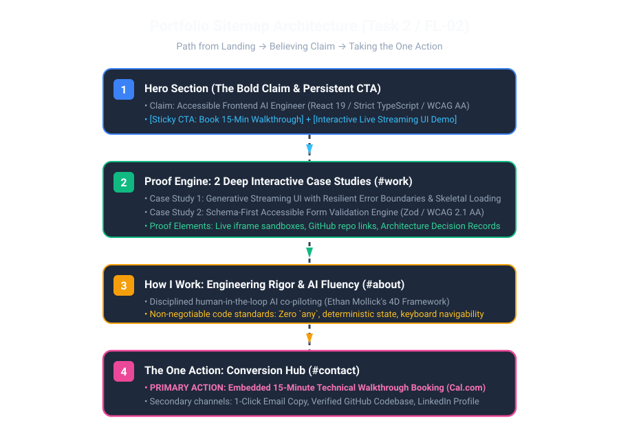

# Task 2: Draw the Path: Portfolio Sitemap + Toolkit

[](#)
[](#)
[](#)
[](#)
[](#)

> **Assignment Reference**: [Draw the Path: Portfolio Sitemap + Toolkit (FlyRank Week 1)](https://aifluency.flyrank.ai/week-01.html#draw-the-path)  
> **Author**: Muhammad Umer  
> **Target Role**: Frontend AI Engineer / Web UI Intern

---

## 📌 The Big Idea: "Solve for your n"

> *"A portfolio with no claim is just decoration, and decoration convinces no one. Your portfolio has exactly one job: to make a specific real person believe you can do a specific thing."*

This repository directory contains the complete architectural foundation, proof statement, lean sitemap, Claude tutor project workspace, and pressure-test outputs for **Week 1: Draw the Path**.

---

## 📂 Deliverables Directory Structure

```
ai fluency tasks/task 2/
├── README.md                      # Master executive summary & compliance matrix
├── SITEMAP_AND_PROOF.md           # The 1-paragraph proof statement, lean sitemap breakdown & pressure-test
├── CLAUDE_PROJECT_TUTOR.md        # Custom instructions (proof statement + Socratic tutor persona)
├── TOOLKIT_SETUP.md               # 4-Tool matrix (Claude, ChatGPT, Gemini, Perplexity)
├── SUBMISSION_TEMPLATE.md         # Exact links, reviewer notes, and file upload instructions for portal
├── sitemap-sketch.svg             # Visual architecture diagram of the portfolio sitemap
├── sitemap-sketch.png             # Photo/screenshot placeholder of hand-drawn/visual sitemap sketch
└── claude-project-tutor.png       # Screenshot placeholder of configured Claude project & pressure-test
```

---

## 🎯 1. The Foundation: Proof Statement

### The One-Paragraph Proof Statement:
> **"I build production-grade, accessible frontend interfaces for generative AI web applications using React 19, TypeScript strict mode, and resilient streaming UX patterns. I am building this portfolio for a Technical Lead or Engineering Manager at an AI-first product startup who needs a frontend engineer who can turn unpredictable LLM tokens into dependable, WCAG 2.1 AA-compliant user experiences. The single action I want them to take is to book a 15-minute technical walkthrough call to examine my live code architecture and discuss an engineering role."**

### Why This Needs to Exist:
> *"A static resume or LinkedIn profile cannot prove how I handle unpredictable streaming token errors, layout shifts during LLM generations, and keyboard-accessible generative state—a focused interactive portfolio proves it in 30 seconds."*

---

## 🗺️ 2. Lean Portfolio Sitemap (Walking to the One Action)

Every single page/section earns its place directly against the **Claim** and the **One Action**:



| Section / Route | Core Purpose | Content Elements | Why It Earns Its Place |
| :--- | :--- | :--- | :--- |
| **1. Hero (`/` Top)** | State the claim immediately | Headline, subhead with stack, sticky CTA button, and interactive live demo. | Informs the technical lead within 3 seconds who I am and captures immediate interest. |
| **2. Proof Engine (`#work`)** | Prove the claim with code | 2 deep case studies (Generative Streaming UI & Schema Form) with live sandboxes and GitHub links. | An engineering manager only believes claims backed by real working code and architectural trade-offs. |
| **3. How I Work (`#about`)** | Establish diligence & standards | 3 bullets: Schema-first validation, WCAG 2.1 AA accessibility, and disciplined AI collaboration (Ethan Mollick 4D). | Differentiates from vibe-coders by demonstrating structured engineering habits. |
| **4. The One Action (`#contact`)** | Convert interest into a call | Embedded 15-min booking scheduler (Cal.com), direct email copy button, and CV download. | Eliminates friction so the lead can book the walkthrough call in one click. |

> **Pages Resisted & Omitted**:
> - ❌ *No generic multi-page blog*: Adds cognitive load and maintenance debt before the primary claim is proven.
> - ❌ *No 40-logo "skills wall"*: The 2 live interactive case studies prove the stack directly.
> - ❌ *No complex multi-page routing*: Keeps the conversion path unbroken on a high-velocity single page.

---

## 🧪 3. Socratic Tutor Pressure-Test & Changes Made

Inside the dedicated Claude Project, the sitemap was aggressively pressure-tested from the perspective of an Engineering Manager.

* **Prompt Sent**: Asked the tutor to identify where the visitor loses trust, where friction exists, and how to accelerate the conversion path to the one action.
* **Claude Tutor's Critique**: Found that placing the booking action solely at the bottom created drop-off risk, and noted that static case study cards wouldn't immediately prove claims of "accessible streaming UI."
* **Changes Made**:
  1. **Sticky Top Action Bar**: Added a persistent top header with the primary CTA (*"Book 15-Min Walkthrough"*) and a live availability indicator (*"🟢 Open for AI Frontend Roles"*).
  2. **Interactive Hero Proof Widget**: Embedded a functional streaming UI micro-component directly into the Hero fold with an interactive error-simulation toggle, proving the claim within the first 5 seconds.

---

## 🛠️ 4. Free AI Toolkit Setup

| Engine | Role in Portfolio Build | Access URL |
| :--- | :--- | :--- |
| **Claude** | Primary Socratic Tutor & Workspace (Houses custom instructions for all 8-10 weeks) | [claude.ai](https://claude.ai) |
| **ChatGPT** | Cross-model validator & prompt benchmarking | [chatgpt.com](https://chatgpt.com) |
| **Gemini** | Multimodal wireframe & layout analysis | [gemini.google.com](https://gemini.google.com) |
| **Perplexity** | Real-time research for latest React 19, Tailwind, and WCAG standards | [perplexity.ai](https://perplexity.ai) |

---

## ✅ Evaluation Criteria Compliance Matrix

| Evaluation Criteria | Requirement | Status | Evidence Location |
| :--- | :--- | :---: | :--- |
| **One primary claim is named** | Single primary skill, not three skills hiding behind "and" | **PASS** | Frontend AI Engineering (React 19 / TypeScript / Accessible Gen-UI) |
| **One specific person & one action** | Technical Lead/EM at AI startup; 15-min walkthrough call | **PASS** | Stated in [SITEMAP_AND_PROOF.md](file:///c:/Users/umerf/Desktop/Code/flyrank-tasks/ai%20fluency%20tasks/task%202/SITEMAP_AND_PROOF.md#1-the-foundation-proof-statement) |
| **Sitemap is small & earns its place** | Only pages that walk visitor from claim to action | **PASS** | 4-section linear flow, unnecessary pages explicitly omitted |
| **Claude Project configured with genuine instructions** | Proof statement pasted in + request to act as tutor | **PASS** | Documented in [CLAUDE_PROJECT_TUTOR.md](file:///c:/Users/umerf/Desktop/Code/flyrank-tasks/ai%20fluency%20tasks/task%202/CLAUDE_PROJECT_TUTOR.md) |
| **Pressure-test conducted & change noted** | Aggressive critique run; at least one structural change recorded | **PASS** | Sticky CTA header + interactive Hero proof widget noted |
