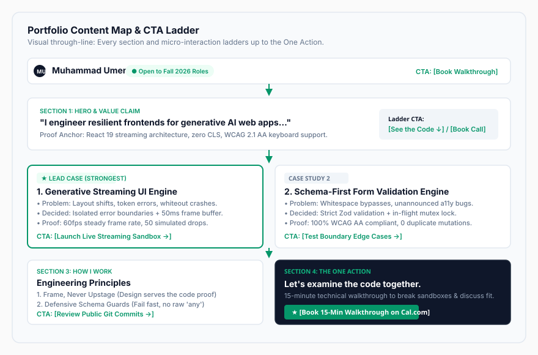

# Task 7: Consistency, Not Talent (and Frame, Not Upstage) (FL-03)

[](#)
[](#)
[](#)
[](#)
[](#)
[](#)

> **Assignment Reference**: [FL-03: Consistency, Not Talent (FlyRank Week 3)](https://aifluency.flyrank.ai/week-03.html)  
> **Author**: Muhammad Umer  
> **Target Audience**: Frontend Engineering Manager / Tech Lead at an AI-First Product Startup  
> **The One Action**: Book a 15-minute live technical walkthrough call  

---

## 📌 Executive Summary

> *"First you decide exactly what goes on which page and where every page sends the visitor. Then the look: a clean, confident face from a few choices made once and repeated. The one rule that is special to a portfolio: the design frames the work, it never steals the show."*

This repository directory contains the complete architectural, visual, and curatorial deliverables for **Week 3: Consistency, Not Talent (and Frame, Not Upstage)**. 

Extending the portfolio foundation and case framing developed in Weeks 1 and 2, this task locks in the entire user journey:
1. **The Through-Line**: A razor-sharp **one-line claim** (selected from 10 AI options and sharpened), an ordered **content map** with an intentional CTA ladder leading directly to the **One Action**, and an honest **"still need to gather" checklist** to guarantee zero friction in upcoming build weeks.
2. **Identity Kit**: A disciplined visual system comprising a free Google Fonts pairing (`Geist` + `Inter`), a quiet 4-color palette audited against **WCAG 2.1 AAA/AA** contrast standards, custom vector `logo.svg` and `favicon.svg` assets, and a 2-line standing style prompt for AI workspaces.
3. **Kill Your Darlings (Image Curation)**: A strict image manifest enforcing real software captures for engineering proof, real photography for personal identity, and clinical rejection post-mortems of 3 generated AI concepts demonstrating genuine aesthetic and technical discernment.

---

## 📂 Deliverables Directory Structure

```
ai fluency tasks/task 7/
├── README.md                           # Master showcase, executive summary & compliance matrix
├── THROUGH_LINE_CONTENT_MAP.md         # Part 1: 10 AI claims, sharpened choice, content map & gather list
├── IDENTITY_KIT.md                     # Part 2: Typography, 4-color palette, WCAG audit, 2-line style note
├── IMAGE_CURATION_AND_REJECTIONS.md    # Part 3: Image manifest, real capture rules, ruthless AI rejection notes
├── SUBMISSION_TEMPLATE.md              # Ready-to-copy portal submission fields (Links, Notes, Uploads)
├── logo.svg                            # Production vector logo lockup for navigation header
├── favicon.svg                         # Scalable high-contrast browser tab favicon (32x32)
└── content-map-diagram.svg             # Visual architecture diagram of page hierarchy and CTA ladder
```

---

## 🎯 1. The Through-Line: One-Line Claim & CTA Ladder

### The Sharpened One-Line Claim:
> **"I engineer resilient frontends for generative AI web apps—taming streaming layout shifts, token errors, and accessibility in React 19 and TypeScript."**

* **Origin**: Generated 10 candidate variations with Claude 3.5 Sonnet across 4 strategic angles (Outcome, Craft, Contrarian, Direct Value).
* **Why It Wins**: Explicitly names the three hardest physical problems in modern generative UI development (Cumulative Layout Shift, token stream drops, keyboard accessibility) while anchoring the exact modern tech stack.

### Content Hierarchy & CTA Ladder:
Every page section and micro-interaction ladders directly up to the **One Action**:



| Section Order | Section ID | Core Content | Primary Micro-CTA | How It Ladders to the One Action |
| :-: | :--- | :--- | :--- | :--- |
| **0** | `Header / Nav` | `MU.` logo + Availability Pill | `[Book Walkthrough]` | Direct shortcut to booking scheduler. |
| **1** | `Hero` | One-line claim + streaming token mini-demo | `[See the Code ↓]` | Pulls reviewer down into deep-dive evidence. |
| **2** | `Proof: Case 1` *(Star)* | **Generative Streaming UI & Error Boundaries** | `[Launch Live Sandbox →]` | Demonstrates real runtime stability under API drops. |
| **3** | `Proof: Case 2` | **Schema-First Form Validation Engine** | `[Test Form Edge Cases →]` | Proves WCAG 2.1 AA rigor and boundary testing. |
| **4** | `Standards` | 3 engineering principles & commit logs | `[Inspect Public Code →]` | Proves disciplined development and code quality. |
| **5** | `The One Action` | Cal.com scheduler + direct email copy | **`[Confirm 15-Min Walkthrough]`** | **Converts the visit into a live calendar call.** |

---

## 🎨 2. Identity Kit: "Frame, Never Upstage"

```
┌────────────────────────────────────────────────────────────────────────┐
│                        THE 4-COLOR IDENTITY PALETTE                    │
├───────────────────┬───────────────────┬────────────────┬───────────────┤
│    Near-White     │    Near-Black     │   Subtle Slate │  Signal Mint  │
│    Background     │    Primary Text   │  Muted Surface │  Single Accent│
│     #FAFAFA       │      #0F172A      │    #64748B     │    #059669    │
│  (Warm Canvas)    │    (Slate 900)    │  (Slate 500)   │ (Emerald 600) │
